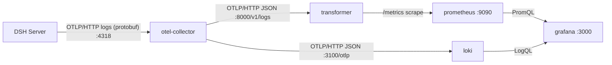

# Architecture

## 1. Context

End-to-end pipeline that exports DeepSeek Harness (DSH) session telemetry to a
**local** stack (Prometheus + Loki + Grafana) so token usage, USD cost, cache
effectiveness and session **results** can be analysed by type, session, model,
tool and effort, and over time. All traffic is confined to the host.

## 2. High-level architecture

### 2.1 Data flow

1. DSH pushes OTLP/HTTP **logs** (protobuf) to the collector on host `4318`.
2. The collector batches (`memory_limiter` + `batch`) and re-exports the stream
   twice in parallel: as OTLP/HTTP **JSON** to the transformer, and to Loki.
3. The transformer parses each record and produces metrics: tokens,
   **edge-computed USD cost** (versioned pricing) and **session results** from a
   terminal event. It exposes `/metrics` and `/healthz`.
4. Prometheus scrapes `transformer:8000` every 10s and evaluates alert rules.
5. Loki stores the raw log stream; Grafana queries Prometheus (metrics) and Loki
   (raw logs / session context).

### 2.2 Component responsibilities

| Component       | Responsibility |
|-----------------|----------------|
| otel-collector  | Receive OTLP/HTTP logs on `4318`; batch; re-export JSON to transformer and Loki. No log→metric conversion. |
| transformer     | Only component with logic. De-duplicate on `(session.id, event.seq)`; emit token/cost/result metrics; resolve model route→tariff, effort, peak/off-peak at the edge. |
| prometheus      | Scrape the transformer every 10s; store time-series; evaluate alert rules. |
| loki            | Single-binary log store keeping the raw DSH log stream for session context. |
| grafana         | Pre-provisioned Prometheus + Loki sources; auto-imports four dashboards. |

## 3. Design decisions

### 3.1 Why an intermediary transformer
DSH emits OTLP *logs*, never metric series, and the collector cannot turn log
bodies into Prometheus counters. A small single-purpose FastAPI service is the
log→metric generator: the collector's export target and Prometheus' scrape
target. It owns all business logic and is kept simple.

### 3.2 Collector → downstream transport
The collector's `otlp_http/transformer` exporter uses `encoding: json` (the
transformer is a JSON endpoint, not protobuf) at base `http://transformer:8000`
(the exporter appends `/v1/logs`). A parallel `otlp_http/loki` exporter
(`http://loki:3100/otlp`, gzip) duplicates the stream to Loki.

### 3.3 De-duplication
A **bounded** LRU keyed by `(session.id, event.seq)` prevents double counting on
retries (`DSH_DEDUP_CAPACITY`, default 100 000). Records without a stable
identity are always counted.

### 3.4 Cost at the edge
USD cost is computed on ingest (`transformer/pricing.py`) from a versioned table
(`configs/pricing.json`). Model **routes** (`deepseek-chat`/`deepseek-reasoner`)
are normalised to **tariff** names (`deepseek-v4-flash`/`-pro`); peak/off-peak is
decided by record timestamp (UTC); a price row is active once
`effective_from <= record_time`. `decodeTokens` is counted as a token but
deliberately **not billed** (its relation to `output`/reasoning is unconfirmed).
This is the single USD source of truth.

### 3.5 Result contract
A session **terminal event** carries a JSON body with `status`
(completed/failed/error) plus optional `quality_estimate`, `files_changed`,
`lines_added`, `lines_deleted`, `methods_added`. Such records are counted as
results (outcome / work counters + quality gauge) and never as token/cost usage.

### 3.6 Cardinality and model-label semantics
`task_type`, `experiment`, `user_id` live in Loki / sparse counters, not on every
Prometheus counter. On `dsh_tokens_total`, `model` is the telemetry **route**;
on cost/result counters it is the normalised **tariff** — join across them via
`route_map` in `configs/pricing.json` when needed.

### 3.7 Wire robustness
The transformer tolerates the collector's JSON: `body` as an OTLP `AnyValue`
(including a JSON-string payload) and `attributes` as OTel `repeated KeyValue`
arrays, as well as plain maps. Token/result fields are matched by **leaf key
name**, flat or nested.

## 4. Notes
- One USD source of truth (the transformer); third-party plugins (`dsh-analytics`,
  `dsh-plugin-otel-genai`) are not wired in (deferred/skipped after review).
- Everything is local; no external SaaS.
- Alerts are evaluated by Prometheus locally (no external notifier/Alertmanager).
