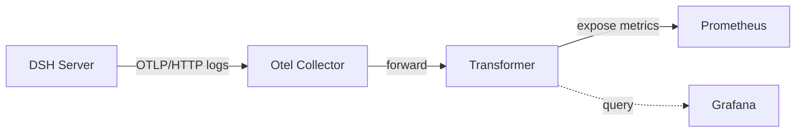

# Architecture Overview

## 1. Context
This document describes the overall architecture of the telemetry export pipeline for DeepSeek Harness (DSH).

## 2. High-Level Architecture

### 2.1 Context Diagram

Arrows represent data flow, punctuated lines represent request/response channels.

### 2.2 Component Responsibilities

 | Component         | Responsibility                                                                                         |
 |-------------------|--------------------------------------------------------------------------------------------------------|
 | Otel Collector    | Receive OTLP logs, handle batching, and forward to transformer. No log-to-metric conversion.           |
 | Transformer       | Parse log records, extract token fields, create Prometheus metrics, and expose them.                   |
 | Prometheus        | Scrape metrics from transformer, store time-series (blocks), and serve queries.                        |
 | Grafana           | Query Prometheus through DataSource, render dashboards, and provide UI.                                |

## 3. Design Decisions

### 3.1 Why an intermediary transformer?

The Otel Collector contrib edition does not have a built-in processor to convert OTLP log records into Prometheus metrics. While there are third-party extensions, they require compilex processing and are not as flexible. A custom FastAPI service is lightweight, easy to test, and can be extended for additional metric derivations (in future).

### 3.2 Deduplication strategy

The transformer maintains an in-memory set of seen records (session_id + event.seq) to avoid duplicate counting. This is optional and can be disabled by commenting out the deduplication code.

### 3.3 Label Design

The `day` label is derived from the record’s timestamp (timeUnixNano or observedTimeUnixNano). This enables daily rollup analysis without needing a separate day field.

## 4. Scalability Assumptions
* For typical usage (tens to hundreds of records/sec) the system works without modification.
* For higher volumes (> 10 K/s), consider scaling the transformer horizontally (e.g. with Gunicorn) or using a more efficient serialization (protobuf).

## 5. Future Extensions
* Add support for custom redaction rules (filtering out sensitive data).
* Integrate with an alerting system (e.g. Alertmanager) for token spices.
* Export transformer metrics to Loki for log-based analysis (currently the collector can forward logs to Loki, but the transformer only outputs metrics).
