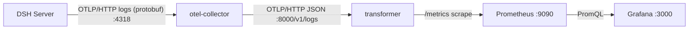

# Architecture

## 1. Context

End-to-end pipeline that exports DeepSeek Harness (DSH) session telemetry to a
**local** observability stack (Grafana + Prometheus) so token usage can be
analysed by token type, session, model and tool, and over time. All traffic is
confined to the host; no external SaaS is used.

## 2. High-Level Architecture

### 2.1 Data flow

1. DSH pushes OTLP/HTTP **logs** (protobuf) to the collector on host port `4318`.
2. The collector batches them (`memory_limiter` + `batch`) and forwards them to
   the transformer over HTTP with `encoding: json`.
3. The transformer parses each log record, extracts numeric usage fields and
   increments the `dsh_tokens_total` counter (labels: `type`, `session_id`,
   `model`, `tool`).
4. Prometheus scrapes `transformer:8000/metrics` every 10s.
5. Grafana queries Prometheus and renders the auto-provisioned dashboard.

### 2.2 Component responsibilities

| Component        | Responsibility                                                             |
|------------------|----------------------------------------------------------------------------|
| otel-collector   | Receive OTLP/HTTP logs on `4318`, batch, forward as OTLP/HTTP JSON to the transformer. No log→metric conversion. |
| transformer      | Parse log records (OTLP proto-JSON: `AnyValue` + `repeated KeyValue`), de-duplicate, maintain the `dsh_tokens_total` counter, expose `/metrics` and `/healthz`. |
| prometheus       | Scrape the transformer every 10s, store time-series, serve PromQL.         |
| grafana          | Pre-provisioned Prometheus data source + imported **DSH Token Usage** dashboard. |

## 3. Design decisions

### 3.1 Why an intermediary transformer?

DSH emits OTLP *logs*, never metric series, and the OTel Collector has no
built-in "log record → Prometheus counter" transform. A small single-purpose
FastAPI service is therefore the log→metric generator: the collector's export
target and Prometheus' scrape target. It is the only component with business
logic and is deliberately kept simple.

### 3.2 Collector → transformer transport

The collector is configured with an `otlp_http/transformer` exporter that uses
`encoding: json` (base endpoint `http://transformer:8000`; the exporter appends
`/v1/logs`). JSON is required because the transformer is a JSON endpoint, not a
protobuf one.

### 3.3 De-duplication

The transformer keeps a **bounded** LRU of seen records keyed by
`(session.id, event.seq)` so a replayed/retried delivery is not double-counted.
Capacity is bounded (default 100 000, `DSH_DEDUP_CAPACITY`) to avoid an
unbounded memory leak. Records without a stable identity are always counted.

### 3.4 Label design

`dsh_tokens_total` is labelled by `type`, `session_id`, `model`, `tool`. A
per-record `day` label is intentionally **not** emitted: bucketing by day is
left to PromQL (e.g. `increase(dsh_tokens_total[1d])`), which keeps the
counter's label cardinality from growing with time.

### 3.5 Graceful robustness

The transformer tolerates the wire formats the collector actually produces —
`body` as an OTLP `AnyValue` (including a JSON-string payload) and `attributes`
as OTel `repeated KeyValue` arrays — and also plain maps. Token fields are
matched by leaf key name, so they are found whether recorded flat or nested.

## 4. Scalability assumptions

- For the intended scale (tens to hundreds of records/sec) no tuning is needed.
- For much higher volumes, scale the transformer horizontally (multi-worker /
  multiple replicas) or move token derivation closer to DSH.

## 5. Future extensions

- Optional redaction rules for `FULL` payloads.
- Alerting (Alertmanager) on token spend / error severity.
- A separate logs sink (e.g. Loki) if log retention is required in addition to
  the derived Prometheus metrics.
